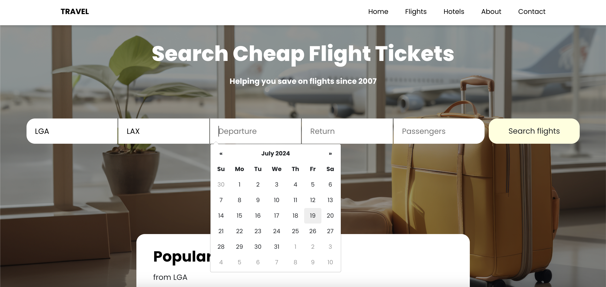
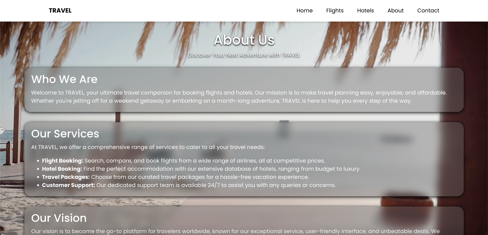

# Microservices Travel Booking Site
Microservices Travel Booking Site is a robust application that provides up to 148,000 loctions and 6,700 airports to query for the latest travel booking flights and hotels. The application was built using Flask, React, MongoDB, AWS Lambda / API Gateway / S3 / CloudFront, and Railway. You may visit the site here: https://d38aezgot1todg.cloudfront.net/. 

## Landing Page

The background of this landing page are high-quality images of travel destinations. Users can navigate from thsi page to the rest of the site through the nav bar. 

## Landing Page Cont.

This is another image of a second video. Users can navigate through the landing-page videos with the dots at the bottom of the page. 

# Flight Booking
## Querying Airports

On this page, users can query the stored airports by name in order to find their desired flight. There is an easy-to-use dropdown for matching queries. When the user clicks search, they are brought to a new page with their inputted information already queried for them.

## Return

In the second input field, users can select a destination where they are going.

## Datepicker

Now users are able to select departure and return dates.

## Datepicker

Here is the completed input field.

## Carousel

Here users can see popular destinations available given their nearest airport location.

## Hotel Booking

This is a similar page for hotel booking with similar functionality. When the user clicks search, they are brought to a new page with their inputted information already queried for them.

## About

Here is the about page.

## Try it out
If you'd like to run the site, you must install React. After installation, you may run it locally by performing the following steps:
```sh
# Clone the repository.
git clone https://github.com/DanielRamsgard/travel-booking-management-front

# Navigate to the project directory.
cd travel-booking-management-front

# Run this command to view the site locally
npm run start

# The application runs on 'http://localhost'
```